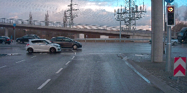
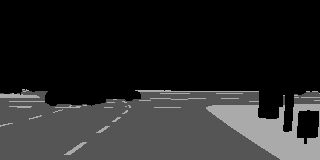
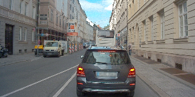
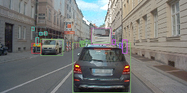
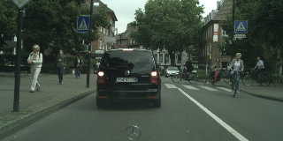
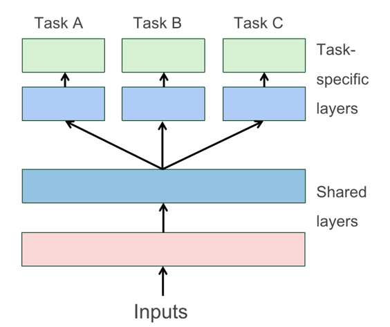
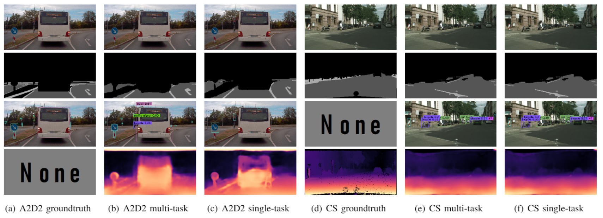

# Introduction
## Introduction

This study is a "Project Intership" in Karlsruhe Institute of Technology, which is a three-people team work by Bangyu Zhu, Eugen Ernst and me (Yin Wu). We appreciate our mentors Vivekanandan Abhishek and Joseph Tim from AIFB institute.

Perception of driving scenes is one of the main topics in autonomous driving domain, which is based on several tasks, for example: semantic segmentation, object detection, depth estimation etc. In recent years, vast amount of methods have been introduced for these specific problems. However, most of them consider one specific single task. One reason for the lack of multi-task learning is that the most available datasets do not include all labesl which are necessary for all tasks simultaneosly.

In this study, we propose a multi-task learing neural network which can be used for training a multi-task learning with labels of different datasets. We compare the multi-task network with its corresponding single task network in terms of performance and computational speed.

We show that the multi-task learning with the introduced training method is able to learn the tasks with labels from two different datasets. Furthermore, the multi-task learning show in two of three single task a better performance and real-time capability.

# Problem Setup
## Semantic Segmentation

The goal of this task is to obtain the static elements of the driving scene. We consider three classes of elements the most important: 

* drivable area
* non-drivable area
* accurate lane marking

The first two classes tell an auto where to drive. Meanwhile, the \textit{accurate lane marking} enhance the cognition of the driving scene to obey the traffic rules.

## Object Detection

Object detection is considered mainly for the dynamic elements in street scenes. We have 7 classes including

* vehichles (6 classes)
  * cars
  * bicycles
  * trucks
  * small vehicles
  * utility vehicles
  * tractors
* pedestrians (1 class)

Besides, we detect two additional static elements during object detection task:

* traffic signal
* traffic sign

## Depth Estimation

In comparison with the first two tasks, depth estimation supplies a three-dimensional depth information of the driving scene. In our training, we use the disparity to substitute depth since it is directly supplied from the dataset.

# Experiments

The structure of our multi-task neural network is mainly based on [ResUNet](https://arxiv.org/abs/1904.00592), [CenterNet](https://arxiv.org/abs/1904.08189) with two datasets for three tasks.

## Datasets

Tasks for [A2D2](https://www.a2d2.audi/a2d2/en/download.html): 

* Semantic Segmentation
* Object Detection

Tasks for [Cityscapes](https://www.cityscapes-dataset.com/downloads/): 

* Semantic Segmentation
* Depth Estimation

# Results

|   | mIoU | mAP | RMSE | GPU Mem Usage | Computation Speed |
|---|------|-----|------|---------------|-------------------|
| Multi-Task Network | 85.57 | 10.9 | 0.0678 | 611 Mb | 45 fps |
| ResUNet (SemSeg) | 82.53 | | | 587 Mb | 39 fps |
| CenterNet | | 11.9 | | 759 Mb | 18 fps |
| ResUNet (Depth) | | | 0.0706 | 587 Mb | 21 fps |